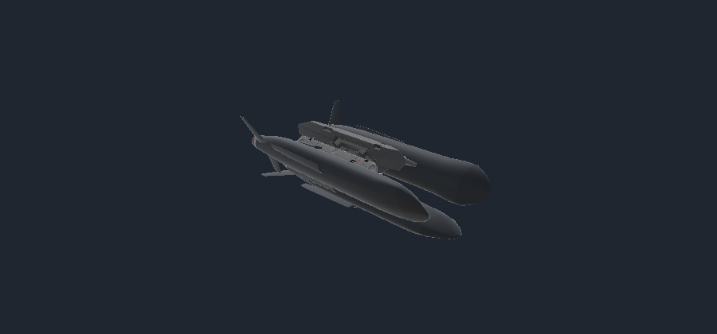
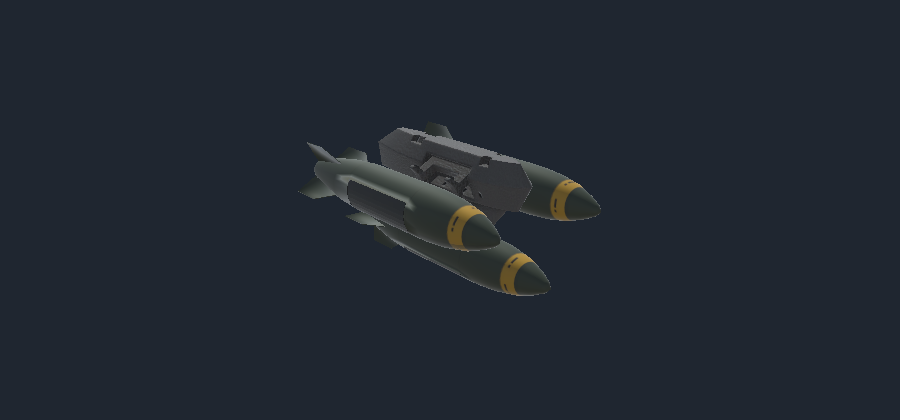

# Circuit Breaker

A tactical suppression and area denial mod for **Nuclear Option**, built with Unity, Blueprinter and a BepInEx/Harmony runtime. The finished pack ships as **one `Circuit-Breaker.dll`**, with its Blueprinter bundle embedded inside.

## Weapons

### AGM-180 Blackout

A high-power microwave cruise missile designed to open a temporary window for friendly aircraft. It follows vanilla cruise-missile guidance, flies low, then performs an 18-second emission run near the designated target. Four pulses temporarily suppress enemy ground radar, lasers and turret acquisition within 2 km. Its small impact charge keeps direct damage low.

External and internal racks offer **one, two or three missiles**. Three is the maximum per individual rack. External mounts use visible vanilla pylons and rails; the wings remain folded on the rack and deploy in flight.



### CBU-82M Locust

An unguided mine dispenser that uses the game's native CCIP aiming. It opens at approximately 175 m and releases eight mines over an elongated footprint. Mines arm four seconds after landing, trigger near vehicles or aircraft within 3 m, and self-destruct after 210 seconds.

Each mine carries **10 kg of conventional HE** and uses native explosion damage. External mounts offer one, two or three dispensers; internal mounts offer one or two. The double rack uses two connected ejector rails, and the triple rack retains the native triangular arrangement.



## Requirements and installation

- Nuclear Option; the imported game API used for this build is **0.34.2**.
- BepInEx.
- Blueprinter **2.0.1 or later**.

Build the DLL using the steps below, then place `Circuit-Breaker.dll` in `BepInEx/plugins`. The DLL includes the mod bundle; installing its `.nobp` separately would load the content twice.

## Build from source

1. Open a configured Blueprinter Editor project in **Unity 2022.3.62f3**, with the matching Nuclear Option assemblies and imported vanilla placeholders.
2. Copy this repository into `Assets/Blueprinter/Mods/Iron Gate`, excluding `.git` and `docs`.
3. Run **Blueprinter → Circuit Breaker → Create assets**, then **Build bundle** in Unity.
4. Run `Tools~/Build.ps1` from PowerShell. It compiles the Release DLL and verifies that the embedded bundle matches the Unity output byte for byte.

The runtime project accepts `GameDir` and `BlueprinterProject` properties when your installation differs from the development paths. For example, after building the Unity bundle:

```powershell
& './Tools~/Build.ps1' -GameDir 'D:/Games/Nuclear Option' -BlueprinterProject 'D:/Mods/Blueprinter-Editor'
```

The verified output DLL is in `Delivery~`. Generated delivery files and local archives are excluded from Git.

## Source layout

- Root `.asset`, `.prefab` and `.anim` files: weapon definitions, rack variants, deployment animations and carrier operations.
- `Models`, `Textures`, `Materials`: supplied visuals and Unity material assignments.
- `Editor`: prefab generation, reference checks, previews and Blueprinter packaging.
- `Tools~/Runtime`: HPM suppression, mine behavior and embedded-bundle loading.
- `Tools~/AuditBundle.py`: independent UnityFS content checks; requires Python and UnityPy.

## Validation

Unity previews, prefab references, rack ammunition counts, native attachment layouts, material textures, runtime API compatibility, Release compilation and embedded-resource hashes have been checked. Flight, suppression, CCIP agreement, mine triggering and multiplayer behavior still require live mission testing.

This is a community mod and is not affiliated with the game's developers.
