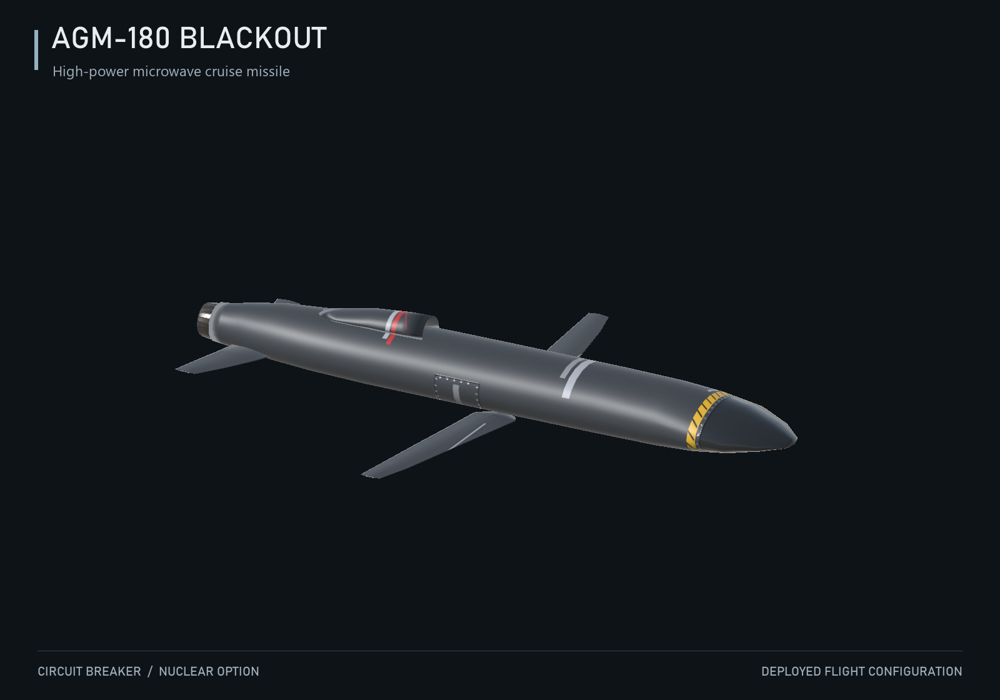
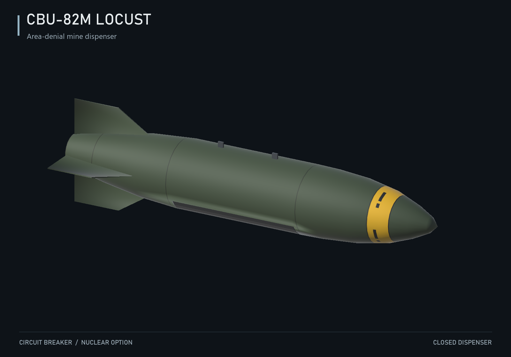
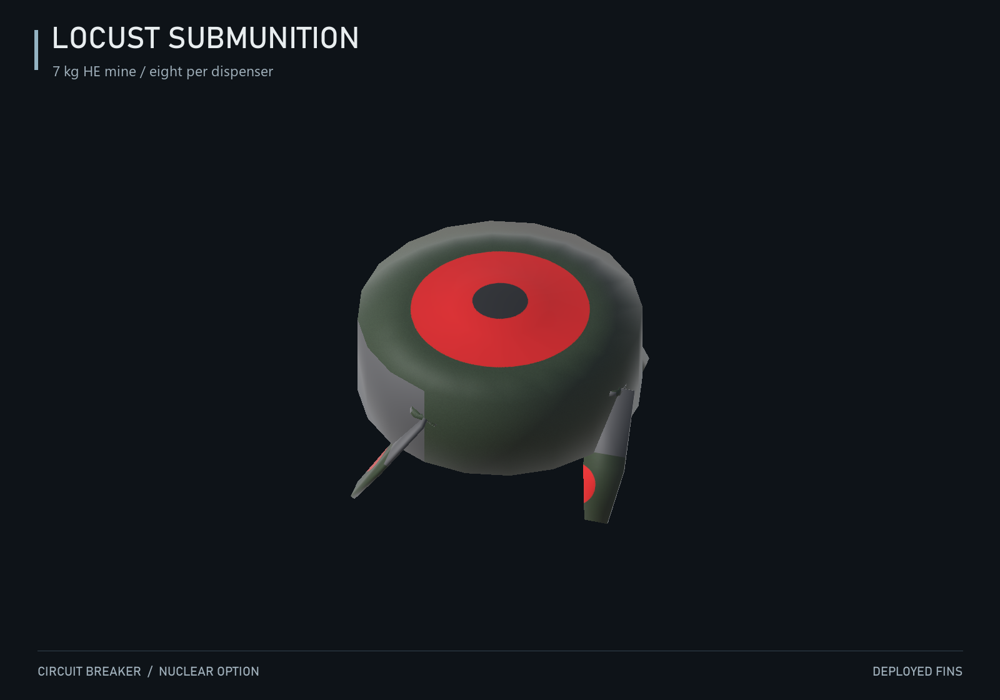
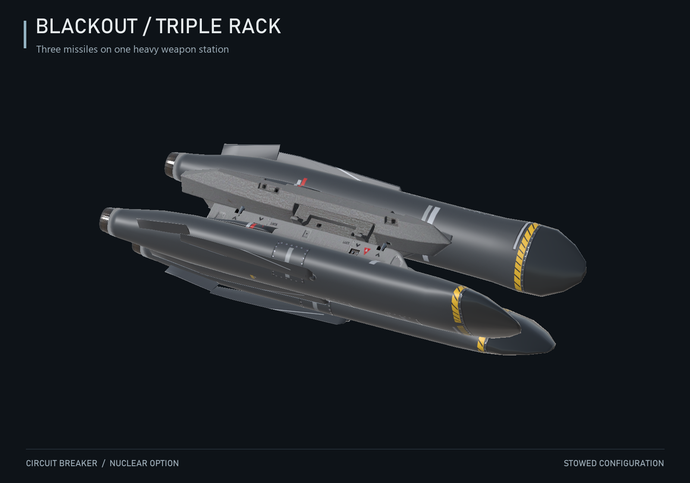
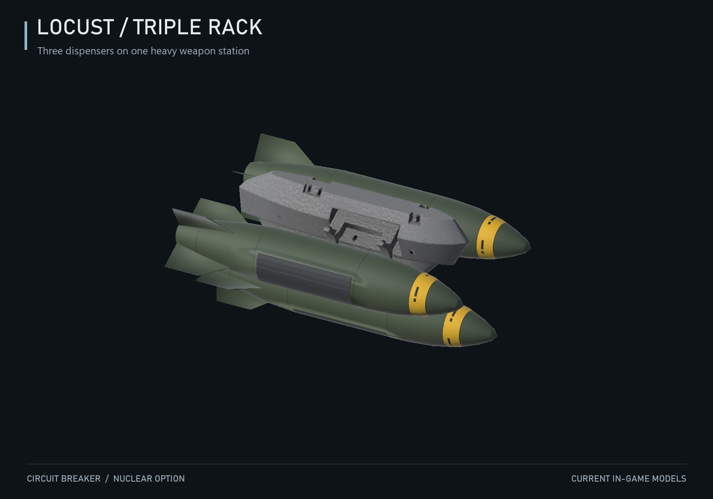

# Circuit Breaker

Current release: v0.1.16 (non-radar weapon launch hotfix; early testing). Player mission tests confirm effective ground air-defense suppression and reliable Locust mine deployment. Further testing is needed for radar recovery, varied terrain, overlapping emitters and multiplayer.

Source code and documentation for a Nuclear Option tactical weapons mod. The playable pack is delivered as one `Circuit-Breaker.dll`, containing the gameplay runtime and an embedded Blueprinter bundle.

This repository contains code, build scripts, tests, text documentation and rendered gallery images. Models, textures, icons, materials, prefabs, Unity metadata, game assemblies and compiled artifacts are not included. A configured local asset workspace or an existing Blueprinter bundle is required to build the playable mod.

## Weapon gallery

Actual current Unity models, rendered with their in-game materials.







<details>
<summary>Triple-rack configurations</summary>





</details>

## AGM-180 Blackout

Blackout captures the target assigned to each missile when it is fired. Deselecting that target or selecting a different unit afterwards does not change the missile's designation. It does not activate or redirect toward unrelated radars encountered along the route.

HPM starts when the remembered enemy ground radar or missile air-defense target is within 10 km of the missile. The mod has no player-facing GPS designation interface; a selected ground radar/SAM is required. Vanilla free-fire supplies a point 50 km ahead rather than a player-selected GPS coordinate, so targetless Blackout launches are rejected. Explicit launches against ordinary tanks are rejected. No aircraft suppression occurs before this activation gate is met.

Once active, the missile emits continuously for 20 seconds. Coverage follows the missile within a 10 km radius, refreshes every 0.25 seconds and respects static terrain shielding. Enemy ground radar, laser defenses and missile-turret acquisition are suppressed; gun CIWS retains degraded aiming. Native jamming events provide map indicators.

Aircraft of every faction in the emission zone, including the launch aircraft and other friendly aircraft, lose radar contacts and access to remote datalink contacts. Local optical observations remain usable. Ground electronics and aircraft recover four seconds after their last HPM exposure. They remain suppressed through the first three seconds; overlapping active emitters extend the outage. The old 18-second recovery configuration is migrated automatically. This is applied per receiver without deleting the shared faction tracking database. Optical, inertial, infrared, laser-guided and unguided weapons retain native launch behavior even while datalink is unavailable. Only ARH/SARH weapon launches retain the radar-contact gate; native seekers still determine whether guidance succeeds.

The nominal terrain clearance is 35 m. Forward/downward probes inspect terrain and roofs up to six seconds ahead, including a swept corridor for narrow structures. Pitch requests ramp gradually and native maneuver limits remain in control; late obstacle detection can still result in a crash. Impact detonation uses the small native 2 kg HE charge, and disabled custom visuals are cleaned up.

The missile holds its pass until the full emission charge expires, then attacks its remembered surviving unit. A fallback target may be selected only after emission ends if the original unit is gone; the remembered last target position remains the fallback when no suitable unit is nearby.

External and internal racks offer one, two or three missiles, with a maximum of three per rack. Compatible aircraft stations are expanded from the native ALM-C450 and AGM-68 heavy-missile options, with each rack limited by the station's native ammunition capacity. Rack placement, weapon icons and exhaust appearance are local Unity assets and are preserved during runtime-only updates.

## CBU-82M Locust

Locust is an unguided 400 kg mine dispenser using native CCIP aiming. Deployment is independent of target selection or detection. Its controller is bound at spawn, and ground clearance uses native radar altitude with a sea-level fallback when no ground collider is available. Empty or impacted containers are cleaned up. It aligns with its falling velocity, opens its doors before releasing four pairs of mines, and finishes deployment at approximately 325 m above terrain.

Each of the eight mines carries 7 kg of conventional HE, arms four seconds after landing, triggers within 3 m of vehicles or aircraft, and self-destructs after 210 seconds. Damage uses native explosions. External racks hold one, two or three dispensers; internal racks hold one or two. Locust is also offered on native 250 kg bomb stations, with suitable internal/external rack types and capacities. Its physical mass remains 400 kg; this hotfix changes loadout compatibility.

## Installed mod-aircraft compatibility

The v0.1.13 compatibility profile follows weapon options in the installed aircraft bundles. MiG-29 is deliberately excluded. Rack counts follow each native station's capacity; Blackout never exceeds three per rack.

| Aircraft | Blackout | Locust |
| --- | --- | --- |
| FS-41 Eclipse | Yes | Yes |
| CI-23 Camel | Yes | Yes |
| FS-3 Ternion | Yes | Yes |
| F-16M King Viper | Yes | Yes |
| F-99 Shrike | Yes | Yes |
| XFS-21 Helios | Yes | Yes |
| KR-33 Agni | Yes | Yes |
| F-22E Strike Raptor | No matching heavy-missile station | Yes |

Compatibility is serialized through Blueprinter carrier operations. These new aircraft placements require in-game checks; their original rack geometry and missile/bomb behavior are preserved.

## Requirements and installation

- Nuclear Option; the imported API used for development is 0.34.2.
- BepInEx.
- Blueprinter 2.0.1 or later.

Place the verified `Circuit-Breaker.dll` in `BepInEx/plugins`. Do not also install its embedded `.nobp` separately. Peers should use the same DLL for multiplayer.

## Building

For a runtime-only build, supply the intended local bundle as `Tools~/Runtime/Bundle/CircuitBreaker.nobp`, along with the matching game and Blueprinter reference assemblies, then run:

```powershell
& './Tools~/Build.ps1' -GameDir 'D:/Games/Nuclear Option' -BlueprinterProject 'D:/Mods/Blueprinter-Editor'
```

The script builds Release, verifies the embedded bundle SHA-256 against the input, and writes `Delivery~/Circuit-Breaker.dll` and a hash report. Runtime and bundle versions can differ when an unchanged approved bundle is reused.

To update visuals, use a complete local Blueprinter asset workspace in Unity 2022.3.62f3. The editor code provides a build-only action that packages existing assets. Avoid regenerating weapons or racks over manually edited icons, exhaust and pylon placement. This repository alone cannot reconstruct the omitted visual assets.

`Tools~/AuditBundle.py` checks the actual UnityFS bundle and requires Python with UnityPy. `Tools~/Tests` contains numerical guidance and HPM activation/scope checks. Game assemblies and local bundles must not be committed.

## Source layout

- `Editor`: local Unity/Blueprinter asset-generation and packaging code.
- `Tools~/Runtime`: launch designation, guidance, collision handling, suppression, receiver-specific datalink filtering and mines.
- `Tools~/Tests`: focused standalone policy and numerical checks.
- `Tools~/Build.ps1`: verified single-DLL packaging.
- `Tools~/PrepareRepository.ps1`: prepares an isolated publishing checkout with code and text only.

## Validation

The startup regression test executes all seven production configuration bindings against the installed BepInEx library, including migration of the old 18-second recovery setting. Versions v0.1.12-v0.1.14 contain an invalid equal-min/max range that can abort plugin initialization; update to v0.1.15.
This project is an unofficial community modification and is not affiliated with, sponsored by, or endorsed by Shockfront Studios Pty Ltd. Original Nuclear Option assets, vehicle designs, audio, and code are Copyright (c) 2026 Shockfront Studios Pty Ltd. All rights reserved. Nuclear Option and Shockfront Studios are trademarks or registered trademarks of Shockfront Studios Pty Ltd. Original mod content and all other trademarks belong to their respective owners.

Release compilation, bundle/reference checks, embedded-resource hashes and focused numerical/policy tests are structural evidence. Earlier user mission tests confirmed ground air-defense suppression. The latest launch-target activation, aircraft datalink filtering, collision cleanup and multiplayer behavior still require mission verification.

This is a community mod and is not affiliated with the game's developers.
